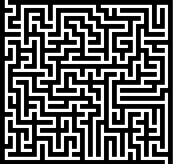

# BadType

| Task             | BadType                   |
|------------------|---------------------------|
| Competition      | [Teaser Dragon CTF 2019](https://ctftime.org/event/851)    |
| Location				 | Online 									 |
| Category         | Reverse engineering       |
| Platform         | Windows x64               |
| Scoring          | 400 pts (medium)          |
| Number of solves | 9 out of 297 teams        |

## Description

We found this boring Windows program that only ever seems to display one message. Can you make it display something else?

## Solution summary

Click to expand

The task is a short, statically built 64-bit Windows PE file. It takes the flag in `argv[1]` (should be 50 bytes long), converts it to 200 2-bit values and insert them into an OpenType font stream in static memory. Then, it loads the font via `AddFontMemResourceEx`, creates a window and displays a "BAD FLAG:\\" string using the custom font. Or at least it appears to do so, because in fact our font only defines the "B" glyph, which contains the outline of the whole "BAD FLAG" message. The purpose is to make the program display a "GOOD FLAG" message.

The challenge itself is implemented in OpenType Charstrings (http://www.adobe.com/content/dam/acom/en/devnet/font/pdfs/5177.Type2.pdf), i.e. programs for a relatively simple VM interpreted by the system font engine (the `atmfd.dll` Windows driver in Windows <= 8.1, and the user-mode `fontdrvhost.exe` process in Windows 10). The purpose of the task is to extract the font from static memory, decompile it (preferably with the `ttx` tool from the `fontTools` suite) and analyze it to find a flag that will pass all of the internal checks.

The key to the problem is to realize that the CharStrings actually implement a maze of size 43x41 that the player needs to go through with a correct sequence of 200 moves (each of them up/down/left/right). The player starts at position (1, 0) and must reach (41, 40):

There are a number of Charstring subroutines defined in the font, which do the following:

* 0-7: helper routines for drawing subcomponents of the full glyphs.
* 8: draws the "GOOD FLAG" message.
* 9: draws the "BAD FLAG" message.
* 10: no-op, used for error conditions, i.e. `CALL 9+(!error)`.
* 11: main dispatcher of a single move operation.
* 12-15: functions performing the actual movement on current x,y in the four directions.
* 16-56: per-row maze checks if the current x position is on an empty tile or wall.
* 57: helper function for shuffling the direction identifiers (so that they are different in each step).

There is also the main "B" glyph program which initializes the internal state, performs the sequence of 200 moves, then verifies the current coordinates and displays one of the good/bad flag outlines.

Once the font is fully reverse engineered, the remaining step is to write a script to solve the maze (or solve it by hand), and then convert the path to a string accepted by the challenge. This should result in the following flag:
**DrgnS{OpenType_CharStrings_thats_neverending_fun!}**.

